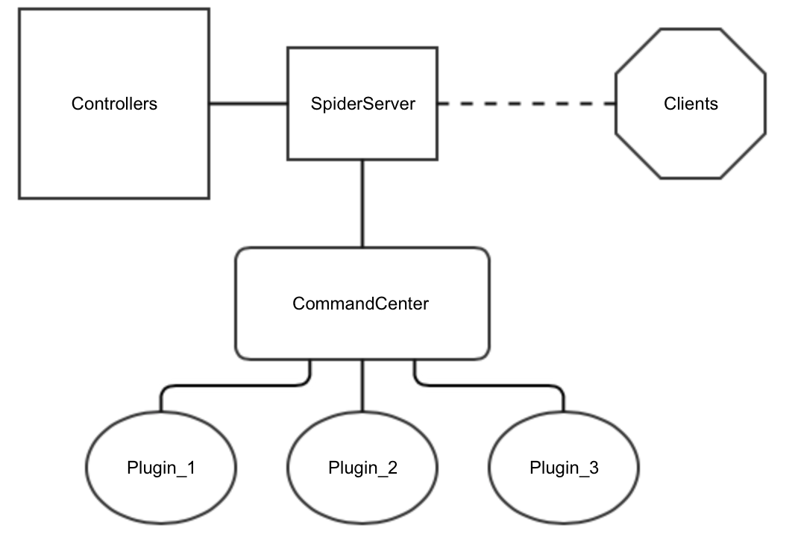

# cpp_spider
Ce document détaille le fonctionnement du projet _cpp\_spider_.

## Généralités
La communication client/serveur est chiffrée en TLSv1 grâce à la bibliothèque OpenSSL.
Cette communication est séparé en 2 canaux : un cannal dit de commandes, et un canal de données.

Les données échangées sur le canal de commandes sont des commandes textuelles, terminées par un CRLF. Les données échangés sur l'autre canal sont échangées dans un format binaire défini par notre logiciel.

Les victimes sont identifiés grâce à leurs adresses MAC.

## Protocole
### Canal de commandes
Lors de sa connexion, un client doit envoyer 

```
/connect MAC_ADDRESS\r\n
```
où MAC_ADDRESS est l'adresse MAC du client.

Le serveur répond à ceci 

```
/setup PORT_DATA\r\n
```
où PORT_DATA est le port auquel le client peut se connecter pour échanger des données.

Une fois ces étapes effectuées, il est possible de contrôler le client via les différentes commandes de notre protocole.

> Par défaut, le client n'enregistre aucune information sur le client.


| Commande                 	| Action                                                                                         	|
|--------------------------	|------------------------------------------------------------------------------------------------	|
| /getInfos\r\n            	| Récupère les informations de la victime (OS, architecture, page size, nombre de CPUs, RAM ...) 	|
| /setMouseEmission\r\n    	| Active/désactive la capture de la souris                                                       	|
| /setKeyboardEmission\r\n 	| Active/désactive la capture du clavier                                                         	|
| /replicate\r\n           	| Demande au client d'infecter un fichier                                                        	|
| /kill\r\n                	| Stoppe le processus du client                                                                  	|
| /ping\r\n                	| Vérifie que le client est toujours connecté                                                                 	|

### Canal de données

Les données échangées sur le canal de données sont dans un format binaire propre à notre logiciel.
Ces données se décomposent en un entête + un event.

```cpp
using PathArray = std::array<std::uint8_t, 64>;
using MacAddrArray = std::array<std::uint8_t, 6>;

enum class PacketType : std::uint8_t {
	KeyboardEvent = 0,
	MouseButton,
	MousePosition,
	Screenshot,
	Infos
};

struct PacketHeader {
	std::uint64_t time;       // Timestamp
	PacketType    type;       // Packet type
	MacAddrArray  macAddress; // MAC address of the emitter
};
```

Nous définissons ensuite plusieurs types de packets.

```cpp
enum class PacketEventState : std::uint8_t {
	Down = 0,
	Up
};

struct PacketEvent {
	std::uint32_t    key;         // The key / button that was pressed
	PacketEventState state;       // The state of the pressed key / button
	std::uint8_t     repeat;      // How many time was this key pressed during this event ?
	std::uint8_t     shift;       // is shift pressed ?
	PathArray        processName; // The foreground process at the moment of the event
};

struct PacketMov {
	std::uint32_t    posX;        // Position X of the mouse
	std::uint32_t    posY;        // Position Y of the mouse
	PathArray        processName; // Same as above
};

struct PacketImgHeader {
	std::uint32_t    totalSize;   // Total size of the image
	std::uint32_t    size;        // Size of this chunk of the image
	std::uint16_t    id;          // Current part of the image chunk
};

struct PacketInfos {
	std::uint16_t    procArch;    // Processor architecture
	std::uint8_t     arch;        // 32/64 bits
	std::uint8_t     os;          // Operating system
	std::uint32_t    pageSize;    // Page size
	std::uint16_t    nbProc;      // Number of CPUs
	std::uint64_t    ram;         // Installed memory
};
```
Nous avions prévus l'envoi de capture d'écrans, malheureusement cette fonctionalité n'a pas abouti.

Le client envoie des packets sur ce canal, sans attendre aucune réponse de la part du serveur.

Lors de la compilation, il est possible de définir une macro (`SPIDER_SERIALIZE`) permettant de (dé)sérialiser les données afin de permettre une compatibilité avec des machines avec des endianness différents.

## Client
Notre client est composé d'un noyau cross-plateform, et de modules propre à chaque plateforme ciblée. Les-dits modules sont présentés sous la forme d'un `.so` dans le cas de Linux, d'un `.dylib` dans le cas de MacOS, et d'un `.dll` sous Windows.

Lors du démarrage du client, le noyau (dit _core_) charge le module spécifique à la plateforme. Une fois ce chargement effectué, le core vérifie la présence de deboggeur, et vérifie que le processus n'est pas analysé par un anti-virus. Si le core n'est pas analysé, il procède ensuite à l'initialisation du module, puis à l'initialisation d'un thread de communication réseau. En cas d'erreur, le processus est arrêté.

Le thread de réseau essaie continuellement de se connecter au serveur, en espaçant chaque tentative échouée de 3 secondes. Une fois connecté, celui-ci est responsable de la transmission des ordres du serveur au core, et de l'envoi des informations envoyés par ce dernier. La communication inter-thread est effectuée au moyen de `queues` thread-safe.
Ainsi, si pour une raison la connexion réseau est interrompue, l'ensemble des évènements détectés reste sauvegardé dans une `queue`, et ces évènements seront par la suite envoyés au serveur dès que la connexion sera rétablie.

De son coté, le core effectue une boucle infinie répétant les étapes suivantes:

	- Vérification de la présence d'un deboggeur
	- Récupèration et traitement des commandes envoyés par le serveur
	- Appel de la méthode 'run' de module chargé

En cas de détection d'un deboggeur, le core s'arrête.

#### Module

Un module est une bibliothèque dynamique réalisée pour un système d'exploitation particulier.
Afin d'homogénéiser leur conception, les modules doivent implémenter le code suivant:

```cpp
static spider::client::library::SpiderPlugin payload;

extern "C" {
SPIDER_API spider::client::library::IPayload *getPayload()
{
  return static_cast<spider::client::library::IPayload *>(&payload);
}
```

Ils doivent également se conformer à l'interface `IPayload`.

#### Speficités Windows

Sous Windows, différentes protections sont mises en place.
La console d'exécution est cachée, on empêche le lancement de plus d'une instance du programme (via le système de mutex kernel), on supprime l'entête `PE` de l'exécutable, on enregistre le programme en tant que programme de démarrage (grâce à une entrée dans le registre), on change les droits DACL afin d'empêcher la fermeture de l'exécutable via le `Task Manager`, et on rend l'exécutable "critique" (sous certaines versions anciennes de Windows, une fermeture du programme entrainera un BSOD).

On désactive également la _croix_ permettant habituellement de fermer un processus. Ceci n'est utile que dans le cas exeptionnel où la console resterait visible.

Dans le cas d'un executable 32 bits, on cache également le thread (il ne sera pas visible via un deboggeur), et on falsifie la taille de l'exécutable mappé en mémoire (empêchant ainsi un dump correct de la mémoire).

Tout au long de l'exécution du virus, ce dernier cherche le processus dénommé `Task Manager` et se charge de le tuer si il est trouvé.

#### Speficités Linux

Aucune spécificité.

#### Speficités MacOS

Aucune spécificité. 


## Serveur

Notre serveur dispose également d'un système de plugin sous forme de bibliothèques dynamiques.
Au démarrage, nous chargeons un objet dénommé `CommandCenter`, qui s'occupe du chargement des différents plugins. 



Les clients du serveur peuvent être controlés par des éléments dénommés `Controllers`. Nous disposons actuellement de deux `Controllers`: un `Shell` et un `WebServer` (ce dernier met à disposition une API Restful).
L'ensemble de la communication interne s'effectue via un système de `queues`.

Un plugin peut être réalisé grâce aux informations disponibles dans un autre document (`../project/server_plugin/readme.md`).

Les plugins sont chargés d'effectuer les envois réseaux, et les envois de réponse aux controllers. Ceci est possible grâce à l'interface `IEventable`, directement inspirée des `IEquatable` et autres `protocols` disponibles dans la bibliothèque standart du Swift.